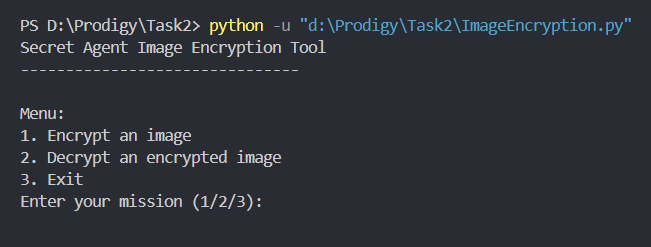

# Secret Agent Image Encryption Tool



The Secret Agent Image Encryption Tool is a Python application that allows you to encrypt and decrypt images using a secret seed value. It uses the PIL (Python Imaging Library) to manipulate images and achieve encryption and decryption through pixel shuffling.

## Features

- **Image Encryption**: Encrypt any image file by shuffling its pixels based on a secret seed value.
- **Image Decryption**: Decrypt previously encrypted images using the same secret seed value.
- **Simple and Secure**: Provides a straightforward method to protect image content using basic cryptographic techniques.

## Installation

1. **Clone the repository**:
    ```sh
    git clone https://github.com/chirag2103/secret-agent-image-encryption.git
    ```
   
2. **Navigate to the project directory**:
    ```sh
    cd secret-agent-image-encryption
    ```
   
3. **Install dependencies**:
    This project requires the PIL library, which can be installed using pip:
    ```sh
    pip install Pillow
    ```

## Usage

1. **Run the application**:
    ```sh
    python secret_agent_image_encryption.py
    ```
   
2. **Menu Options**:
    - **Encrypt an image**: Choose option '1', enter the image file path, and provide a secret seed value.
    - **Decrypt an encrypted image**: Choose option '2', enter the encrypted image file path, and provide the same secret seed value used for encryption.
    - **Exit the tool**: Choose option '3' to exit the application.

3. **Example**:
    - Encrypting an image:
      ```
      Enter your mission (1/2/3): 1
      Enter the image file path: path/to/your/image.png
      Enter the secret seed value for encryption: 12345
      Image encrypted and saved as image_encrypted.png
      ```
    - Decrypting an encrypted image:
      ```
      Enter your mission (1/2/3): 2
      Enter the encrypted image file path: path/to/your/image_encrypted.png
      Enter the secret seed value for decryption: 12345
      Image decrypted and saved as image_decrypted.png
      ```

## Contributing

Contributions are welcome! Please fork this repository and submit pull requests with any enhancements or bug fixes.

1. **Fork the repository**.
2. **Create a new branch** for your feature or bug fix.
3. **Commit your changes**.
4. **Push to your branch**.
5. **Submit a pull request**.

## License

This project is licensed under the MIT License. See the [LICENSE](LICENSE) file for more details.

## Acknowledgments

- Inspired by the need for a simple yet effective image encryption tool.
- Developed using Python and the Pillow library for image processing.

---

Feel free to customize this README file further to fit your project's specific details and requirements. Include additional sections such as troubleshooting, FAQs, or advanced usage scenarios as needed.
